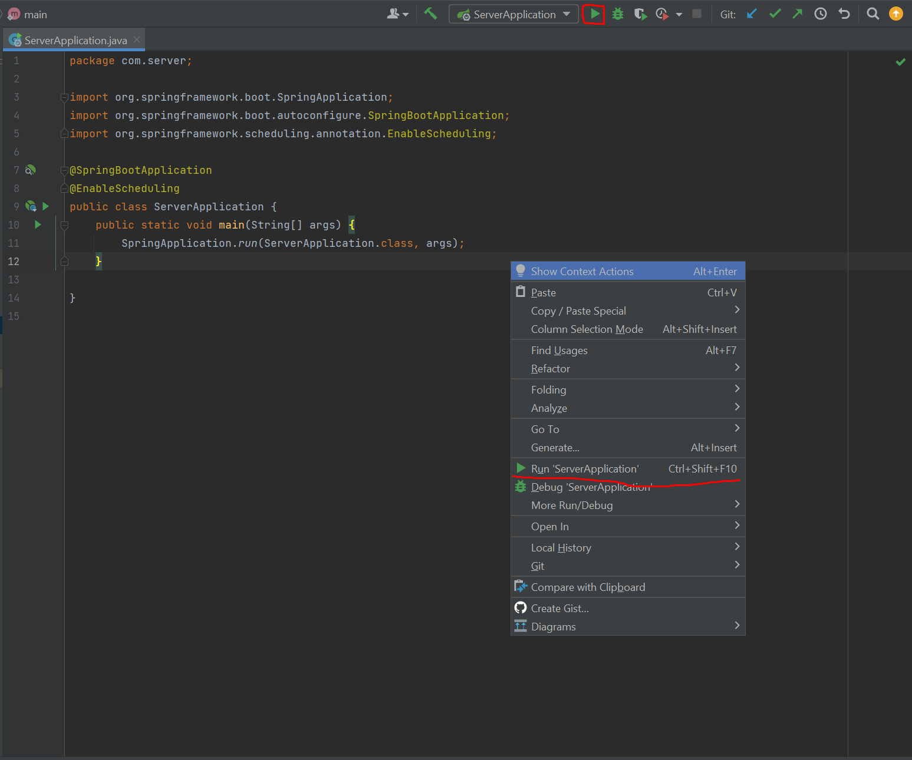

# **Mobile App: Running the Server**

### **Clone the source code**
 - Clone or download the source code from GitHub (https://github.com/MingHaoC/comp4990/edit/main/server/README.MD)

### **Creating a MySQL database:**
 - Create an empty database (remember the name)
   - Ex. `CREATE DATABASE COMP4990` - COMP4990 is the name of the database in this example

### **Setup steps:**
 1. Open the project with an IDE, Intellij/Eclipse (Make sure you open the Server folder and not the entire project)
 2. Open the following file `server/src/main/resources/application.properties`
 3. Update the following information (make sure you remove the "[]" when adding your database information
	-	[MySQL_Server_URL] - URL where the MySQL server is being hosted (localhost:3306 if you're hosting it on your computer)
	-	[DATABASE_NAME] - Name of the database that you created
	-	[DATABASE_USERNAME] - Username to access the MySQL server
	-	[DATABASE_PASSWORD] - Password to access the MySQL server
 4.	Run the server application
 	-	The database table will be created automatically
 	-	One way to run the application is to open the file ServerApplication inside an IDE (IntelliJ is used for the screenshot below) and right click anywhere inside the file and click `Run ServerApplication`.
 	-	Another way is to click the green triangle on the top right of the screenshot below

 5.	Execute the following SQL command into the database console
	-	`INSERT INTO roles (id, name) VALUES (1, ‘ROLE_USER’)`
	-	`INSERT INTO roles (id, name) VALUES (2, ‘ROLE_ADMIN’)`
	
# **TODO**
 -	Automate the server setup using Docker container
